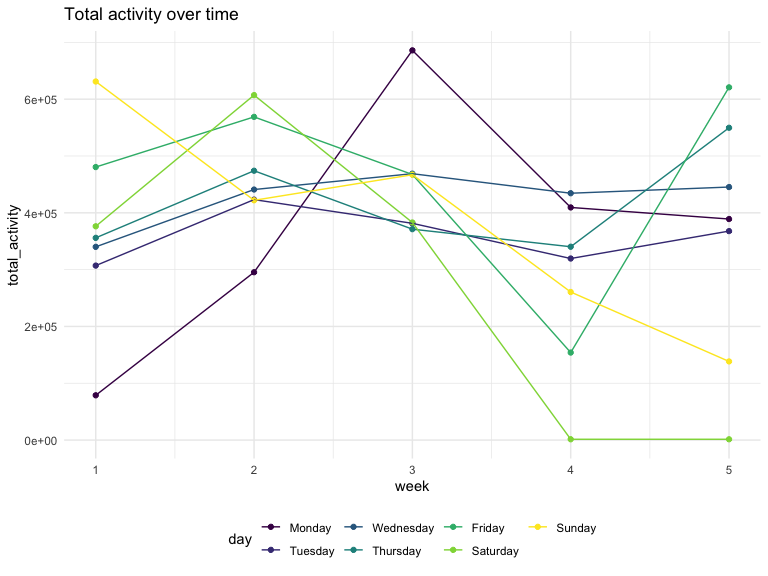

Homework 3
================
Jenesis Merriman
October 15, 2022

``` r
library(tidyverse)
library(readr)
```

### Problem 1

``` r
library(p8105.datasets)
data("instacart")
```

### Problem 2

Accelerometers have become an appealing alternative to self-report
techniques for studying physical activity in observational studies and
clinical trials, largely because of their relative objectivity. During
observation periods, the devices measure “activity counts” in a short
period; one-minute intervals are common. Because accelerometers can be
worn comfortably and unobtrusively, they produce around-the-clock
observations.

This problem uses five weeks of accelerometer data collected on a 63
year-old male with BMI 25, who was admitted to the Advanced Cardiac Care
Center of Columbia University Medical Center and diagnosed with
congestive heart failure (CHF). In this spreadsheet, variables
activity.\* are the activity counts for each minute of a 24-hour day
starting at midnight.

Load, tidy, and otherwise wrangle the data. Your final dataset should
include all originally observed variables and values; have useful
variable names; include a weekday vs weekend variable; and encode data
with reasonable variable classes. Describe the resulting dataset
(e.g. what variables exist, how many observations, etc):

First I will load the data, cleaning names:

``` r
accel_data = 
  read_csv("data/accel_data.csv") %>%
  janitor::clean_names() %>%
  view()
```

    ## Rows: 35 Columns: 1443
    ## ── Column specification ────────────────────────────────────────────────────────
    ## Delimiter: ","
    ## chr    (1): day
    ## dbl (1442): week, day_id, activity.1, activity.2, activity.3, activity.4, ac...
    ## 
    ## ℹ Use `spec()` to retrieve the full column specification for this data.
    ## ℹ Specify the column types or set `show_col_types = FALSE` to quiet this message.

Next, I will tidy the data, using `pivot_longer` to collapse all 1440
activity\* variables into two new variables ‘minute’ and
‘activity_count’. I will also use `mutate` to create a new ‘day_type’
factor variable indicating the type of day (weekday vs. weekend) fo each
observation, make ‘minute’ a double variable, and sort ‘day’ (days of
the week) chronologically.

``` r
accel_tidy_data =
  pivot_longer(
    accel_data, 
    activity_1:activity_1440,
    names_to = "minute", 
    names_prefix = "activity_",
    values_to = "activity_count") %>%
  mutate(
    day_type = as.factor(ifelse(day == "Saturday" | day == "Sunday", "weekend", "weekday")),
    minute = as.double(minute),
    day = as.factor(ordered(day, levels = c("Monday", "Tuesday", "Wednesday", "Thursday", "Friday", "Saturday", "Sunday"))))
  

view(accel_tidy_data)
```

*The resulting dataset contains 50400 rows and 6 columns, with each row
representing a single minute of accelerometer data for a 63 year-old
male over the course of five weeks. Variables include week number
(week), day ID (day_id), day of the week (day), minute of the day
starting at midnight (minute), activity count per minute
(activity_count), and whether or not the observation falls on a weekday
or weekend (day_type).*

Traditional analyses of accelerometer data focus on the total activity
over the day. Using your tidied dataset, aggregate across minutes to
create a total activity variable for each day, and create a table
showing these totals. Are any trends apparent?

The following code returns a table showing the total activity counts for
each day by week:

``` r
accel_tidy_data %>%
  group_by(week, day) %>%
  summarize(total_activity = sum(activity_count)) %>%
  pivot_wider(
    names_from = "day", 
    values_from = "total_activity") %>%
  knitr::kable(digits = 1)
```

    ## `summarise()` has grouped output by 'week'. You can override using the
    ## `.groups` argument.

| week |   Monday |  Tuesday | Wednesday | Thursday |   Friday | Saturday | Sunday |
|-----:|---------:|---------:|----------:|---------:|---------:|---------:|-------:|
|    1 |  78828.1 | 307094.2 |    340115 | 355923.6 | 480542.6 |   376254 | 631105 |
|    2 | 295431.0 | 423245.0 |    440962 | 474048.0 | 568839.0 |   607175 | 422018 |
|    3 | 685910.0 | 381507.0 |    468869 | 371230.0 | 467420.0 |   382928 | 467052 |
|    4 | 409450.0 | 319568.0 |    434460 | 340291.0 | 154049.0 |     1440 | 260617 |
|    5 | 389080.0 | 367824.0 |    445366 | 549658.0 | 620860.0 |     1440 | 138421 |

Accelerometer data allows the inspection of activity over the course of
the day. Make a single-panel plot that shows the 24-hour activity time
courses for each day and use color to indicate day of the week. Describe
in words any patterns or conclusions you can make based on this graph.

``` r
accel_tidy_data %>%
  ggplot(aes(x = minute, y = activity_count, color = day)) + 
    geom_point() + 
    labs(
    title = "Activity time courses by day",
    x = "Minute",
    y = "Activity Count")
```



### Problem 3

The goal is to do some exploration of this dataset. To that end, write a
short description of the dataset, noting the size and structure of the
data, describing some key variables, and indicating the extent to which
missing data is an issue.

``` r
data("ny_noaa")

ny_noaa = 
  ny_noaa %>% 
  as_tibble(ny_noaa)

summary(ny_noaa)
```

    ##       id                 date                 prcp               snow       
    ##  Length:2595176     Min.   :1981-01-01   Min.   :    0.00   Min.   :  -13   
    ##  Class :character   1st Qu.:1988-11-29   1st Qu.:    0.00   1st Qu.:    0   
    ##  Mode  :character   Median :1997-01-21   Median :    0.00   Median :    0   
    ##                     Mean   :1997-01-01   Mean   :   29.82   Mean   :    5   
    ##                     3rd Qu.:2005-09-01   3rd Qu.:   23.00   3rd Qu.:    0   
    ##                     Max.   :2010-12-31   Max.   :22860.00   Max.   :10160   
    ##                                          NA's   :145838     NA's   :381221  
    ##       snwd            tmax               tmin          
    ##  Min.   :   0.0   Length:2595176     Length:2595176    
    ##  1st Qu.:   0.0   Class :character   Class :character  
    ##  Median :   0.0   Mode  :character   Mode  :character  
    ##  Mean   :  37.3                                        
    ##  3rd Qu.:   0.0                                        
    ##  Max.   :9195.0                                        
    ##  NA's   :591786

``` r
view(ny_noaa)
head(ny_noaa)
```

    ## # A tibble: 6 × 7
    ##   id          date        prcp  snow  snwd tmax  tmin 
    ##   <chr>       <date>     <int> <int> <int> <chr> <chr>
    ## 1 US1NYAB0001 2007-11-01    NA    NA    NA <NA>  <NA> 
    ## 2 US1NYAB0001 2007-11-02    NA    NA    NA <NA>  <NA> 
    ## 3 US1NYAB0001 2007-11-03    NA    NA    NA <NA>  <NA> 
    ## 4 US1NYAB0001 2007-11-04    NA    NA    NA <NA>  <NA> 
    ## 5 US1NYAB0001 2007-11-05    NA    NA    NA <NA>  <NA> 
    ## 6 US1NYAB0001 2007-11-06    NA    NA    NA <NA>  <NA>

*This dataset contains 2595176 rows and 7 columns, with each row
representing a single New York state weather station between January 1,
1981 and December 31, 2010. Variables include weather station ID (id),
date of observation (date), precipitation in tenths of mm (prcp),
snowfall in mm (snow),snow depth in mm (snwd), maximum temperature in
tenths of degrees C (tmax), and minimum temperature in tenths of degrees
C (tmin). Because each weather station may collect only a subset of
these variables, the resulting dataset contains substantial missing
data.*

Then, do or answer the following (commenting on the results of each):

Do some data cleaning. Create separate variables for year, month, and
day. Ensure observations for temperature, precipitation, and snowfall
are given in reasonable units. For snowfall, what are the most commonly
observed values? Why?

``` r
ny_noaa_tidy =
  ny_noaa %>%
  janitor::clean_names() %>%
  separate(col = date, into = c("year", "month", "day"), sep = "-") %>%
  mutate(
    month = month.name[as.numeric(month)],
    month = factor(month, levels = month.name), 
    tmax = as.integer(tmax),
    tmin = as.integer(tmin))

head(ny_noaa_tidy)
```

    ## # A tibble: 6 × 9
    ##   id          year  month    day    prcp  snow  snwd  tmax  tmin
    ##   <chr>       <chr> <fct>    <chr> <int> <int> <int> <int> <int>
    ## 1 US1NYAB0001 2007  November 01       NA    NA    NA    NA    NA
    ## 2 US1NYAB0001 2007  November 02       NA    NA    NA    NA    NA
    ## 3 US1NYAB0001 2007  November 03       NA    NA    NA    NA    NA
    ## 4 US1NYAB0001 2007  November 04       NA    NA    NA    NA    NA
    ## 5 US1NYAB0001 2007  November 05       NA    NA    NA    NA    NA
    ## 6 US1NYAB0001 2007  November 06       NA    NA    NA    NA    NA

Make a two-panel plot showing the average max temperature in January and
in July in each station across years. Is there any observable /
interpretable structure? Any outliers?

Make a two-panel plot showing (i) tmax vs tmin for the full dataset
(note that a scatterplot may not be the best option); and (ii) make a
plot showing the distribution of snowfall values greater than 0 and less
than 100 separately by year.
