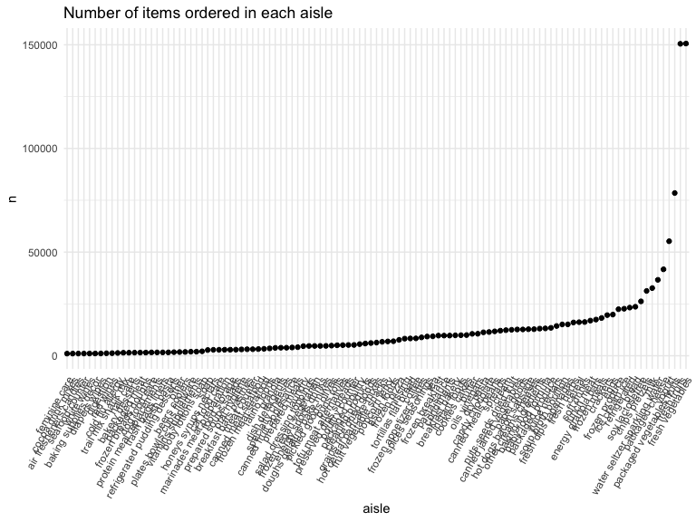
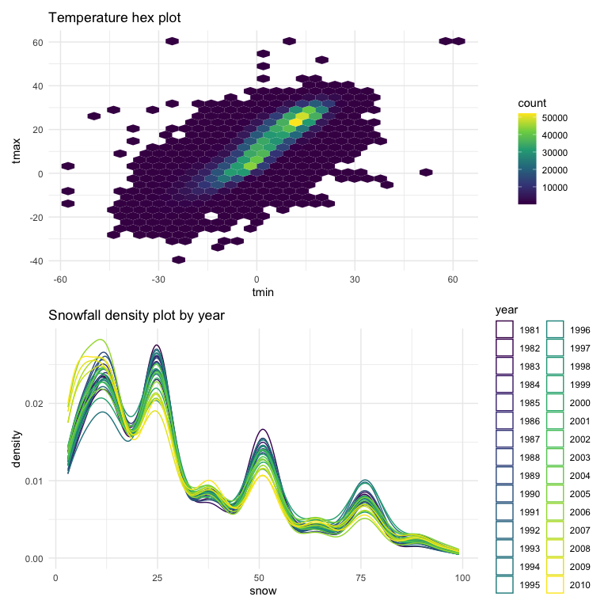

Homework 3
================
Jenesis Merriman
October 16, 2022

## Problem 1

This problem uses the Instacart data. First, I will load the data and do
some exploration.

``` r
data("instacart")

instacart = 
  instacart %>% 
  as_tibble(instacart)
```

**Description**: This dataset contains 1384617 rows and 15 columns, with
each row resprenting a single product from an instacart order. Variables
include information about the product, the store, the user, and
purchasing habits. In total, there are 39123 products found in 131209
orders from 131209 distinct users.

### Part One

The following code tells us how many aisles there are, and which aisles
are the most items ordered from.

``` r
instacart %>% 
  count(aisle) %>% 
  arrange(desc(n))
```

    ## # A tibble: 134 × 2
    ##    aisle                              n
    ##    <chr>                          <int>
    ##  1 fresh vegetables              150609
    ##  2 fresh fruits                  150473
    ##  3 packaged vegetables fruits     78493
    ##  4 yogurt                         55240
    ##  5 packaged cheese                41699
    ##  6 water seltzer sparkling water  36617
    ##  7 milk                           32644
    ##  8 chips pretzels                 31269
    ##  9 soy lactosefree                26240
    ## 10 bread                          23635
    ## # … with 124 more rows

There are 134 aisles in this dataset. The most items are ordered from
the fresh vegetable (n = 150609) and fresh fruit aisle (n = 150473).

### Part Two

The following code makes a plot that shows the number of items ordered
in each aisle for aisles with more than 10000 items ordered. Aisles are
arranged by ascending number of items ordered.

``` r
instacart %>% 
  count(aisle) %>% 
  filter(n > 1000) %>%
  mutate(aisle = fct_reorder(aisle, n)) %>% 
  ggplot(aes(x = aisle, y = n)) + 
  geom_point() + 
  labs(title = "Number of items ordered in each aisle") +
  theme(axis.text.x = element_text(angle = 60, hjust = 1))
```



### Part Three

The following code returns a table showing the three most popular items
in aisles `baking ingredients`, `dog food care`, and
`packaged vegetables fruits`, and includes the number of times each item
is ordered.

``` r
instacart %>% 
  filter(aisle %in% c("baking ingredients", "dog food care", "packaged vegetables fruits")) %>%
  group_by(aisle) %>% 
  count(product_name) %>% 
  mutate(rank = min_rank(desc(n))) %>% 
  filter(rank < 4) %>% 
  arrange(desc(n)) %>%
  knitr::kable()
```

| aisle                      | product_name                                  |    n | rank |
|:---------------------------|:----------------------------------------------|-----:|-----:|
| packaged vegetables fruits | Organic Baby Spinach                          | 9784 |    1 |
| packaged vegetables fruits | Organic Raspberries                           | 5546 |    2 |
| packaged vegetables fruits | Organic Blueberries                           | 4966 |    3 |
| baking ingredients         | Light Brown Sugar                             |  499 |    1 |
| baking ingredients         | Pure Baking Soda                              |  387 |    2 |
| baking ingredients         | Cane Sugar                                    |  336 |    3 |
| dog food care              | Snack Sticks Chicken & Rice Recipe Dog Treats |   30 |    1 |
| dog food care              | Organix Chicken & Brown Rice Recipe           |   28 |    2 |
| dog food care              | Small Dog Biscuits                            |   26 |    3 |

### Part Four

Make a table showing the mean hour of the day at which Pink Lady Apples
and Coffee Ice Cream are ordered on each day of the week; format this
table for human readers (i.e. produce a 2 x 7 table).

``` r
instacart %>%
  filter(product_name %in% c("Pink Lady Apples", "Coffee Ice Cream")) %>%
  group_by(product_name, order_dow) %>%
  summarize(mean_hour = mean(order_hour_of_day)) %>%
  spread(key = order_dow, value = mean_hour) %>%
  knitr::kable(digits = 2)
```

    ## `summarise()` has grouped output by 'product_name'. You can override using the
    ## `.groups` argument.

| product_name     |     0 |     1 |     2 |     3 |     4 |     5 |     6 |
|:-----------------|------:|------:|------:|------:|------:|------:|------:|
| Coffee Ice Cream | 13.77 | 14.32 | 15.38 | 15.32 | 15.22 | 12.26 | 13.83 |
| Pink Lady Apples | 13.44 | 11.36 | 11.70 | 14.25 | 11.55 | 12.78 | 11.94 |

## Problem 2

This problem uses five weeks of accelerometer data collected on a 63
year-old male with BMI 25, who was admitted to the Advanced Cardiac Care
Center of Columbia University Medical Center and diagnosed with
congestive heart failure (CHF).

### Part One

First I will load the data while cleaning names.

``` r
accel_data = 
  read_csv("data/accel_data.csv") %>%
  janitor::clean_names()
```

    ## Rows: 35 Columns: 1443
    ## ── Column specification ────────────────────────────────────────────────────────
    ## Delimiter: ","
    ## chr    (1): day
    ## dbl (1442): week, day_id, activity.1, activity.2, activity.3, activity.4, ac...
    ## 
    ## ℹ Use `spec()` to retrieve the full column specification for this data.
    ## ℹ Specify the column types or set `show_col_types = FALSE` to quiet this message.

Next, I will tidy the data, using `pivot_longer` to collapse all 1440
activity\* variables into two new variables ‘minute’ and
‘activity_count’. I will also use `mutate` to create a new ‘day_type’
factor variable indicating the type of day for each observation, convert
‘minute’ into a double variable, and sort ‘day’ chronologically.

``` r
accel_tidy_data =
  pivot_longer(
    accel_data, 
    activity_1:activity_1440,
    names_to = "minute", 
    names_prefix = "activity_",
    values_to = "activity_count") %>%
  mutate(
    day_type = as.factor(ifelse(day == "Saturday" | day == "Sunday", "weekend", "weekday")),
    minute = as.double(minute),
    day = as.factor(ordered(day, levels = c("Monday", "Tuesday", "Wednesday", "Thursday", "Friday", "Saturday", "Sunday"))))
```

**Description**: The resulting dataset contains 50400 rows and 6
columns, with each row representing a single minute of accelerometer
data for a 63 year-old male over the course of five weeks. Variables
include week number (week), day ID (day_id), day of the week (day),
minute of the day starting at midnight (minute), activity count per
minute (activity_count), and whether or not the observation falls on a
weekday or weekend (day_type).

### Part Two

Traditional analyses of accelerometer data focus on the total activity
over the day. The following code returns a table showing the total
activity counts (total_activity) for each day by week, with days sorted
chronologically from Monday-Sunday.

``` r
accel_tidy_data %>%
  group_by(week, day) %>%
  summarize(total_activity = sum(activity_count)) %>%
  pivot_wider(
    names_from = "day", 
    values_from = "total_activity") %>%
  knitr::kable(digits = 1)
```

    ## `summarise()` has grouped output by 'week'. You can override using the
    ## `.groups` argument.

| week |   Monday |  Tuesday | Wednesday | Thursday |   Friday | Saturday | Sunday |
|-----:|---------:|---------:|----------:|---------:|---------:|---------:|-------:|
|    1 |  78828.1 | 307094.2 |    340115 | 355923.6 | 480542.6 |   376254 | 631105 |
|    2 | 295431.0 | 423245.0 |    440962 | 474048.0 | 568839.0 |   607175 | 422018 |
|    3 | 685910.0 | 381507.0 |    468869 | 371230.0 | 467420.0 |   382928 | 467052 |
|    4 | 409450.0 | 319568.0 |    434460 | 340291.0 | 154049.0 |     1440 | 260617 |
|    5 | 389080.0 | 367824.0 |    445366 | 549658.0 | 620860.0 |     1440 | 138421 |

To help me better visualize trends in this data, the following code
creates a plot displaying total_activity over time by day of the week.

``` r
accel_tidy_data %>%
  group_by(week, day) %>%
  summarize(total_activity = sum(activity_count)) %>%
  ggplot(aes(x = week, y = total_activity, color = day)) +
  geom_point() + 
  geom_line() +
   labs(
    title = "Total activity over time")
```

    ## `summarise()` has grouped output by 'week'. You can override using the
    ## `.groups` argument.


**Trends**: Total activity varies by day and by week. For example, total
activity for Monday increases significantly from week 1 to week 3, then
decreases from week 3 to week 5, while total activity for Sunday
decreases steadily over time, except for a slight increase between week
2 and week 3. At the start of data collection, activity was higher at
the end of the week (Friday-Sunday) than the beginning of it
(Monday-Wednesday). At the end of data collection, activity counts were
lowest on the weekend (Saturday-Sunday). Notably, total activity for
Saturday in weeks 4 and 5 is stagnant at 1440. Since our activity
variables represent activity counts for each minute of a 24-hour day and
there are 1440 minutes in a day, a total_activity count of 1440 is
unusual, indicating 1 activity count per minute. This may indicate that
no activity was recorded on these two Saturdays, or something else, but
it is impossible to know for sure without more information.

### Part Three

Accelerometer data also allows the inspection of activity over the
course of the day. The following code creates a single-panel plot that
shows the 24-hour activity time courses for each day, using color to
indicate the day of the week.

``` r
accel_tidy_data %>%
  ggplot(aes(x = minute, y = activity_count, color = day)) +
  geom_line(alpha = 0.5) + 
    labs(
    title = "Activity time courses by day",
    x = "Minute",
    y = "Activity Count")
```


**Interpretation**: Based on this graph, most activity occurs between 7
am and 10 pm. This makes sense considering most adults sleep somewhere
between 10 pm and 7 am. Activity count peaks around 9 pm (minutes ≈
1250) on weekdays and late morning (minutes ≈ 500-750) on weekends. This
pattern is not unusual, considering most adults work during weekdays and
may be more active after work in the evenings or during the day on
weekends.

## Problem 3

This problem uses the NY NOAA data.

First, I will load the data and describe it.

``` r
data("ny_noaa")

ny_noaa = 
  ny_noaa %>% 
  as_tibble(ny_noaa)
```

**Description**: This dataset contains 2595176 rows and 7 columns, with
each row representing a single observation from a New York state weather
station between January 1, 1981 and December 31, 2010. Variables include
weather station ID (id), date of observation (date), precipitation in
tenths of mm (prcp), snowfall in mm (snow), snow depth in mm (snwd),
maximum temperature in tenths of degrees C (tmax), and minimum
temperature in tenths of degrees C (tmin). Because each weather station
may collect only a subset of these variables, this dataset contains
substantial missing data. There are 3387623 missing values in this
dataset.

### Part One

Next, I will clean the data. The following code uses `separate` to
create separate variables for year, month, and day and `mutate` to
convert variables to reasonable types and units. Specifically, ‘tmax’
and ‘tmin’ were converted from tenths of degrees celsius to degrees
celsius by transforming the variable type from character to numeric and
dividing each value by 10. Similarly, ‘prcp’ was converted from tenths
of a millimeter to millimeters by dividing each value by 10.

``` r
ny_noaa_tidy =
  ny_noaa %>%
  janitor::clean_names() %>%
  separate(col = date, into = c("year", "month", "day"), sep = "-") %>%
  mutate(
    day = as.integer(day),
    year = as.factor(year),
    month = month.name[as.numeric(month)],
    month = factor(month, levels = month.name), 
    prcp = as.double(prcp / 10),
    tmax = as.integer(tmax),
    tmax = as.double(tmax / 10),
    tmin = as.integer(tmin),
    tmin = as.double(tmin / 10))
```

**For snowfall, what are the most commonly observed values? Why?**

``` r
ny_noaa_tidy %>% 
  count(snow) %>% 
  arrange(desc(n))
```

    ## # A tibble: 282 × 2
    ##     snow       n
    ##    <int>   <int>
    ##  1     0 2008508
    ##  2    NA  381221
    ##  3    25   31022
    ##  4    13   23095
    ##  5    51   18274
    ##  6    76   10173
    ##  7     8    9962
    ##  8     5    9748
    ##  9    38    9197
    ## 10     3    8790
    ## # … with 272 more rows

The most commonly observed values for snowfall are 0 mm by far, followed
by NA. This is because there are significantly more days in the year
with no snow (snow = 0) than days with snow in New York. This dataset
also contains extensive missing data, explaining why NA is the second
most commonly observed value for snow.

### Part Two

The following code creates a two-panel plot showing the average max
temperature in January and in July in each station across years.

``` r
ny_noaa_tidy %>%
  filter(
    month %in% c("January","July")) %>% 
  group_by(id, month, year) %>% 
  summarize(
    tmax_mean = mean(tmax, na.rm = TRUE)) %>% 
  ggplot(aes(x = year, y = tmax_mean, group = id, color = id)) +
  geom_line(show.legend = FALSE) +
  theme(axis.text.x = element_text(angle = 60)) +
  facet_grid(.~month) +
  labs(
    title = "Mean max temperature over time",
    x = "Year",
    y = "Mean Max Temperature (C)")
```

    ## `summarise()` has grouped output by 'id', 'month'. You can override using the
    ## `.groups` argument.


**Interpretation**: As expected, values for mean max temperature are
higher in July than in January for our data in New York. Values
fluctuate over time for each month. In January, mean max temperature
ranges from -10 to 10 degrees C, on average. In July, mean max
temperature ranges from 20 to 35 degrees C, on average. There are a few
outliers in each month, including in January 1982, 1993, 2000, and 2004
and in July 1984, 1988, 2004, and 2007.

### Part Three

The following code uses patchwork to create a two-panel plot showing (i)
tmax vs tmin for the full dataset; and (ii) the distribution of snowfall
values greater than 0 and less than 100 separately by year. I will use
`geom_hex` and `geom_density` for each plot, respectively.

``` r
tmax_tmin_p =
  ny_noaa_tidy %>%
  ggplot(aes(x = tmin, y = tmax)) +
  geom_hex() +
  labs(title = "Temperature hex plot") +
  theme(legend.position = "right")

snowfall_p =
  ny_noaa_tidy %>%
  filter(
     snow > 0, snow < 100) %>% 
  group_by(id, month, year) %>% 
  ggplot(aes(x = snow, color = year)) +
  geom_density() +
  labs(title = "Snowfall density plot by year") +
  theme(legend.position = "right")

tmax_tmin_p / snowfall_p
```


