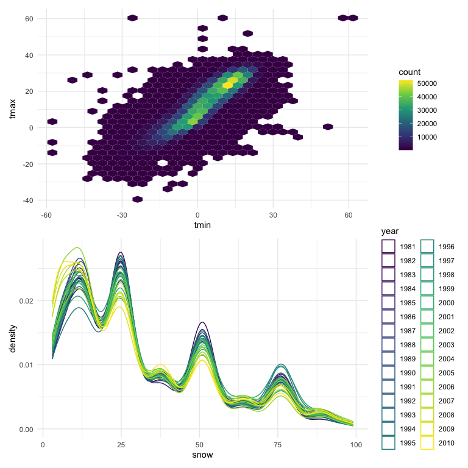

Homework 3
================
Jenesis Merriman
October 16, 2022

``` r
library(tidyverse)
library(readr)
```

## Problem 1

``` r
data("instacart")
```

## Problem 2

This problem uses five weeks of accelerometer data collected on a 63
year-old male with BMI 25, who was admitted to the Advanced Cardiac Care
Center of Columbia University Medical Center and diagnosed with
congestive heart failure (CHF).

### Part One

First I will load the data while cleaning names:

``` r
accel_data = 
  read_csv("data/accel_data.csv") %>%
  janitor::clean_names()
```

    ## Rows: 35 Columns: 1443
    ## ── Column specification ────────────────────────────────────────────────────────
    ## Delimiter: ","
    ## chr    (1): day
    ## dbl (1442): week, day_id, activity.1, activity.2, activity.3, activity.4, ac...
    ## 
    ## ℹ Use `spec()` to retrieve the full column specification for this data.
    ## ℹ Specify the column types or set `show_col_types = FALSE` to quiet this message.

Next, I will tidy the data, using `pivot_longer` to collapse all 1440
activity\* variables into two new variables ‘minute’ and
‘activity_count’. I will also use `mutate` to create a new ‘day_type’
factor variable indicating the type of day (weekday vs. weekend) for
each observation, convert ‘minute’ into a double variable, and sort
‘day’ (days of the week) chronologically.

``` r
accel_tidy_data =
  pivot_longer(
    accel_data, 
    activity_1:activity_1440,
    names_to = "minute", 
    names_prefix = "activity_",
    values_to = "activity_count") %>%
  mutate(
    day_type = as.factor(ifelse(day == "Saturday" | day == "Sunday", "weekend", "weekday")),
    minute = as.double(minute),
    day = as.factor(ordered(day, levels = c("Monday", "Tuesday", "Wednesday", "Thursday", "Friday", "Saturday", "Sunday"))))
```

**Description**: The resulting dataset contains 50400 rows and 6
columns, with each row representing a single minute of accelerometer
data for a 63 year-old male over the course of five weeks. Variables
include week number (week), day ID (day_id), day of the week (day),
minute of the day starting at midnight (minute), activity count per
minute (activity_count), and whether or not the observation falls on a
weekday or weekend (day_type).

### Part Two

Traditional analyses of accelerometer data focus on the total activity
over the day. The following code returns a table showing the total
activity counts (total_activity) for each day by week, with days sorted
chronologically from Monday-Sunday:

``` r
accel_tidy_data %>%
  group_by(week, day) %>%
  summarize(total_activity = sum(activity_count)) %>%
  pivot_wider(
    names_from = "day", 
    values_from = "total_activity") %>%
  knitr::kable(digits = 1)
```

    ## `summarise()` has grouped output by 'week'. You can override using the
    ## `.groups` argument.

| week |   Monday |  Tuesday | Wednesday | Thursday |   Friday | Saturday | Sunday |
|-----:|---------:|---------:|----------:|---------:|---------:|---------:|-------:|
|    1 |  78828.1 | 307094.2 |    340115 | 355923.6 | 480542.6 |   376254 | 631105 |
|    2 | 295431.0 | 423245.0 |    440962 | 474048.0 | 568839.0 |   607175 | 422018 |
|    3 | 685910.0 | 381507.0 |    468869 | 371230.0 | 467420.0 |   382928 | 467052 |
|    4 | 409450.0 | 319568.0 |    434460 | 340291.0 | 154049.0 |     1440 | 260617 |
|    5 | 389080.0 | 367824.0 |    445366 | 549658.0 | 620860.0 |     1440 | 138421 |

To help me better visualize trends in this data, the following code
creates a plot displaying total_activity over time by day of the week:

``` r
accel_tidy_data %>%
  group_by(week, day) %>%
  summarize(total_activity = sum(activity_count)) %>%
  ggplot(aes(x = week, y = total_activity, color = day)) +
  geom_point() + 
  geom_line() +
   labs(
    title = "Total activity over time")
```

    ## `summarise()` has grouped output by 'week'. You can override using the
    ## `.groups` argument.


**Trends**: Total activity varies by day and by week. For example, total
activity for Monday increases significantly from week 1 to week 3, then
decreases from week 3 to week 5, while total activity for Sunday
decreases steadily over time, except a slight increase between week 2
and week 3. At the start of data collection, activity was higher at the
end of the week (Friday-Sunday) than the beginning of it
(Mon-Wednesday). At the end of data collection, activity counts were
lowest on the weekend (Sat-Sun). Notably, total activity for Saturday in
weeks 4 and 5 is stagnant at 1440. Since our activity variables
represent activity counts for each minute of a 24-hour day and there are
1440 minutes in a day, a total_activity count of 1440 is unusual,
indicating 1 activity count per minute. This may indicate that no
activity was recorded on these two Saturdays or something else, but it
is impossible to know for sure without more information.

### Part Three

Accelerometer data also allows the inspection of activity over the
course of the day. The following code creates a single-panel plot that
shows the 24-hour activity time courses for each day, using color to
indicate the day of the week:

``` r
accel_tidy_data %>%
  ggplot(aes(x = minute, y = activity_count, color = day)) +
  geom_line(alpha = 0.5) + 
    labs(
    title = "Activity time courses by day",
    x = "Minute",
    y = "Activity Count")
```


**Patterns**: Based on this graph, most activity occurs between 7am and
10 pm. This makes sense considering most adults sleep somewhere between
10 pm and 7 am. Activity count peaks around 9 pm (minutes ≈ 1250) on
weekdays and late morning (minutes ≈ 500-750) on weekends. This pattern
is not unusual, considering most adults work during weekdays and may be
more active after work in the evenings or during the day on weekends.

### Problem 3

The goal is to do some exploration of this dataset. To that end, write a
short description of the dataset, noting the size and structure of the
data, describing some key variables, and indicating the extent to which
missing data is an issue.

``` r
data("ny_noaa")

ny_noaa = 
  ny_noaa %>% 
  as_tibble(ny_noaa)

summary(ny_noaa)
```

    ##       id                 date                 prcp               snow       
    ##  Length:2595176     Min.   :1981-01-01   Min.   :    0.00   Min.   :  -13   
    ##  Class :character   1st Qu.:1988-11-29   1st Qu.:    0.00   1st Qu.:    0   
    ##  Mode  :character   Median :1997-01-21   Median :    0.00   Median :    0   
    ##                     Mean   :1997-01-01   Mean   :   29.82   Mean   :    5   
    ##                     3rd Qu.:2005-09-01   3rd Qu.:   23.00   3rd Qu.:    0   
    ##                     Max.   :2010-12-31   Max.   :22860.00   Max.   :10160   
    ##                                          NA's   :145838     NA's   :381221  
    ##       snwd            tmax               tmin          
    ##  Min.   :   0.0   Length:2595176     Length:2595176    
    ##  1st Qu.:   0.0   Class :character   Class :character  
    ##  Median :   0.0   Mode  :character   Mode  :character  
    ##  Mean   :  37.3                                        
    ##  3rd Qu.:   0.0                                        
    ##  Max.   :9195.0                                        
    ##  NA's   :591786

``` r
head(ny_noaa)
```

    ## # A tibble: 6 × 7
    ##   id          date        prcp  snow  snwd tmax  tmin 
    ##   <chr>       <date>     <int> <int> <int> <chr> <chr>
    ## 1 US1NYAB0001 2007-11-01    NA    NA    NA <NA>  <NA> 
    ## 2 US1NYAB0001 2007-11-02    NA    NA    NA <NA>  <NA> 
    ## 3 US1NYAB0001 2007-11-03    NA    NA    NA <NA>  <NA> 
    ## 4 US1NYAB0001 2007-11-04    NA    NA    NA <NA>  <NA> 
    ## 5 US1NYAB0001 2007-11-05    NA    NA    NA <NA>  <NA> 
    ## 6 US1NYAB0001 2007-11-06    NA    NA    NA <NA>  <NA>

*This dataset contains 2595176 rows and 7 columns, with each row
representing a single observation from a New York state weather station
between January 1, 1981 and December 31, 2010. Variables include weather
station ID (id), date of observation (date), precipitation in tenths of
mm (prcp), snowfall in mm (snow), snow depth in mm (snwd), maximum
temperature in tenths of degrees C (tmax), and minimum temperature in
tenths of degrees C (tmin). Because each weather station may collect
only a subset of these variables, this dataset contains substantial
missing data. There are 3387623 values missing in this dataset.*

Then, do or answer the following (commenting on the results of each):

Do some data cleaning. Create separate variables for year, month, and
day. Ensure observations for temperature, precipitation, and snowfall
are given in reasonable units.

*To clean the data, the following code uses `separate` to create
separate variables for year, month, and day and `mutate` to convert
variables to reasonable types and units. Specifically, ‘tmax’ and ‘tmin’
were converted from tenths of degrees celsius to degrees celsius by
transforming the variable type from character to numeric and dividing
each value by 10. Similarly, ‘prcp’ was converted from tenths of a
millimeter to millimeters by dividing each value by 10.*

``` r
ny_noaa_tidy =
  ny_noaa %>%
  janitor::clean_names() %>%
  separate(col = date, into = c("year", "month", "day"), sep = "-") %>%
  mutate(
    day = as.integer(day),
    year = as.factor(year),
    month = month.name[as.numeric(month)],
    month = factor(month, levels = month.name), 
    prcp = as.double(prcp / 10),
    tmax = as.integer(tmax),
    tmax = as.double(tmax / 10),
    tmin = as.integer(tmin),
    tmin = as.double(tmin / 10))
```

For snowfall, what are the most commonly observed values? Why?

``` r
ny_noaa_tidy %>% 
  count(snow) %>% 
  arrange(desc(n))
```

    ## # A tibble: 282 × 2
    ##     snow       n
    ##    <int>   <int>
    ##  1     0 2008508
    ##  2    NA  381221
    ##  3    25   31022
    ##  4    13   23095
    ##  5    51   18274
    ##  6    76   10173
    ##  7     8    9962
    ##  8     5    9748
    ##  9    38    9197
    ## 10     3    8790
    ## # … with 272 more rows

*The most commonly observed values for snowfall are 0 mm by far,
followed by NA. This is because there are significantly more days in the
year with no snow (snow = 0) than days with snow. This dataset also
contains extensive missing data, explaining why NA is the second most
commonly observed value for snow.*

Make a two-panel plot showing the average max temperature in January and
in July in each station across years. Is there any observable /
interprettable structure? Any outliers?\*\*\*

``` r
ny_noaa_tidy %>%
  filter(
    month %in% c("January","July")) %>% 
  group_by(id, month, year) %>% 
  summarize(
    tmax_mean = mean(tmax, na.rm = TRUE)) %>% 
  ggplot(aes(x = year, y = tmax_mean, group = id, color = id)) +
  geom_line(show.legend = FALSE) +
  facet_grid(.~month) +
  theme(axis.text.x = element_blank(), legend.position = "none") +
  labs(
    title = "Mean max temperature over time ",
    x = "Year (1981-2010)",
    y = "Mean Max Temperature (C)")
```

    ## `summarise()` has grouped output by 'id', 'month'. You can override using the
    ## `.groups` argument.


Make a two-panel plot showing (i) tmax vs tmin for the full dataset (a
scatterplot may not be the best option); and (ii) make a plot showing
the distribution of snowfall values greater than 0 and less than 100
separately by year.

``` r
tmax_tmin_p =
  ny_noaa_tidy %>%
  ggplot(aes(x = tmin, y = tmax)) +
  geom_hex() +
  theme(legend.position = "right")

snowfall_p =
  ny_noaa_tidy %>%
  filter(
    snow > 0, snow < 100) %>% 
  group_by(id, month, year) %>% 
  ggplot(aes(x = snow, color = year)) +
  geom_density() +
  theme(legend.position = "none") 

tmax_tmin_p / snowfall_p
```


